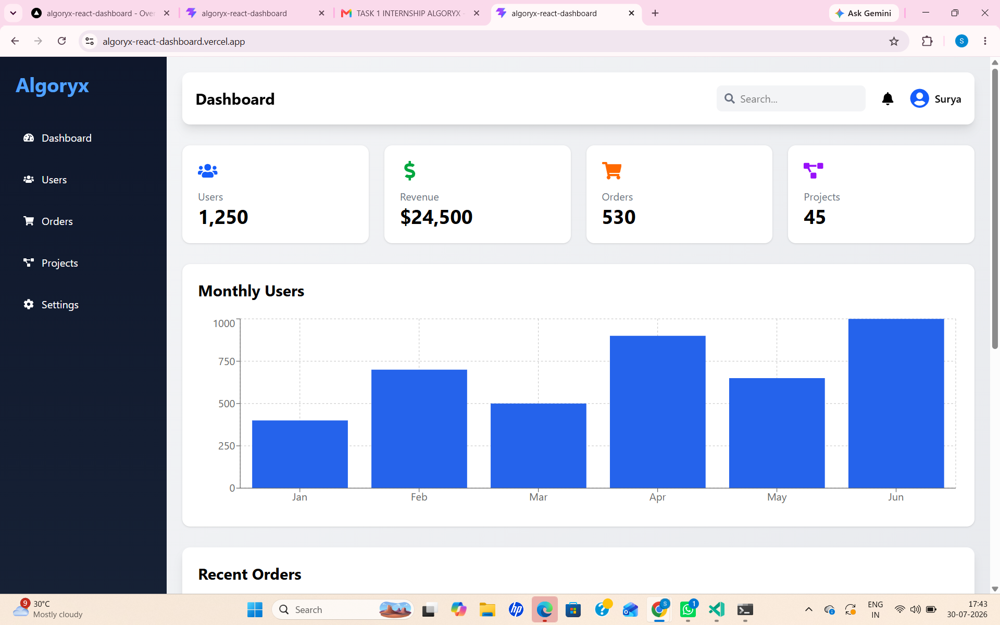
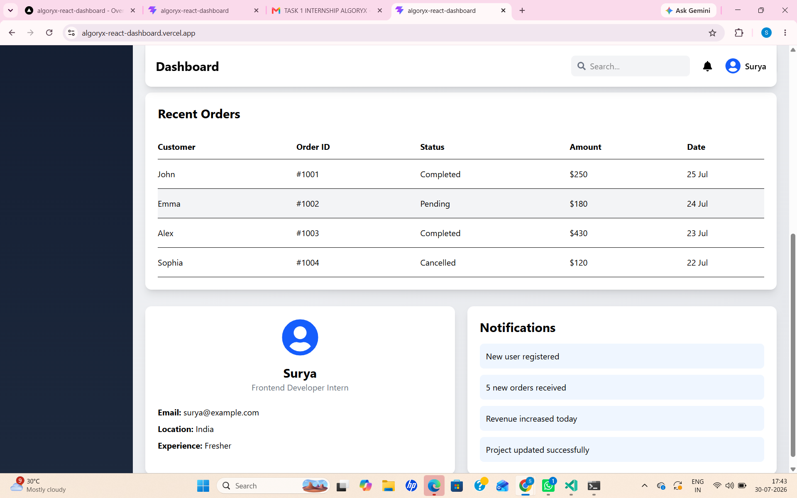

# Algoryx React Admin Dashboard

A modern and responsive React Admin Dashboard built using React.js and Vite.

## 🚀 Features

- Responsive Sidebar
- Responsive Navbar
- Dashboard Cards
- Monthly Users Chart
- Recent Orders Table
- User Profile Card
- Notifications Panel
- Smooth Animations using Framer Motion
- Responsive Design

## 🛠️ Technologies Used

- React.js
- Vite
- Tailwind CSS
- React Icons
- Recharts
- Framer Motion

## 📦 Installation

Clone the repository:

```bash
git clone https://github.com/surya12345-alt/algoryx-react-dashboard.git
```

Go to the project folder:

```bash
cd algoryx-react-dashboard
```

Install dependencies:

```bash
npm install
```

Run the project:

```bash
npm run dev
```

## 🌐 Live Demo

https://algoryx-react-dashboard.vercel.app

## 📷 Screenshots

### Dashboard 1



### Dashboard 2



## 👨‍💻 Author

**Surya Gunturu**